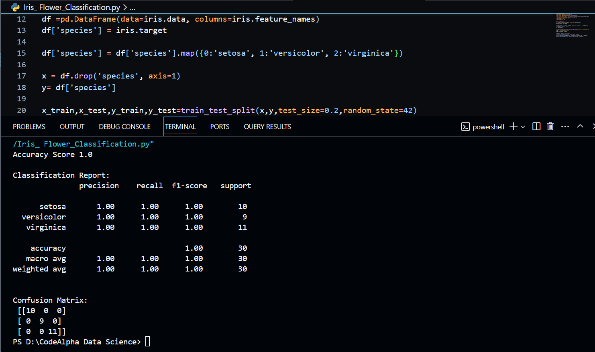

# 🌸 Iris Flower Classification - ML Project



## ✅ Task Overview

**TASK 1: Iris Flower Classification**

This project focuses on building a machine learning model to classify Iris flower species — **Setosa**, **Versicolor**, and **Virginica** — based on their morphological measurements.

---

## 📊 Features

- Utilizes the famous **Iris dataset** from Scikit-learn.
- Classification using ML algorithms such as:
  - Logistic Regression
  - K-Nearest Neighbors
  - Decision Tree
  - Random Forest
- Evaluation of model performance using:
  - **Confusion Matrix**
  - **Accuracy Score**
  - **R² Score**
  - **Mean Squared Error (MSE)**
- Visual representation using **Matplotlib** and **Seaborn**.

---

## 🧠 Machine Learning Concepts Covered

- Supervised learning
- Classification
- Model training & testing
- Performance metrics

---


---

## 🛠️ Libraries Used

- `scikit-learn`
- `pandas`
- `matplotlib`
- `seaborn`
- `numpy`

---

## 🔎 Dataset Information

The Iris dataset contains **150 samples** with the following features:
- Sepal Length (cm)
- Sepal Width (cm)
- Petal Length (cm)
- Petal Width (cm)

Each sample is labeled with one of the species:
- **0 → Setosa**
- **1 → Versicolor**
- **2 → Virginica**

---

## 📈 Model Performance (Example Output)

```text
R² Score: 0.96
Mean Squared Error: 0.04

Confusion Matrix:
 [[10  0  0]
  [ 0  9  0]
  [ 0  0 11]]
  
Accuracy: 100%

✍️ Author
Muhammad Yasir
🌍 Pakistan
📧 [yaisikhan111@gmail.com]

📌 How to Run
Clone the repository:

bash
git clone https://github.com/your-username/CodeAlpha_iris-flower-classification.git

📚 Learning Outcome
By completing this project, I will gain hands-on experience in:

Preparing data for classification

Choosing and training ML models

Visualizing results

Evaluating model performance
